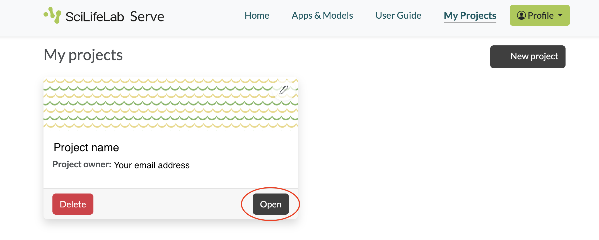
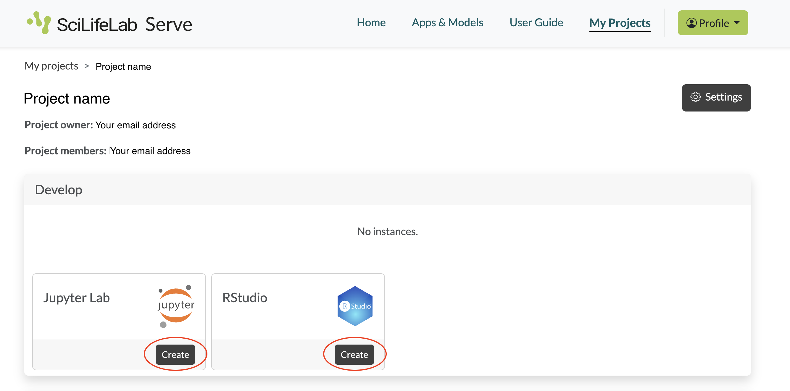
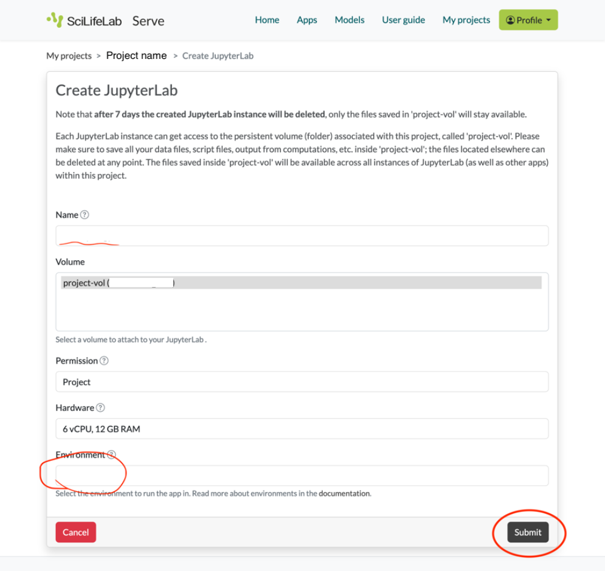
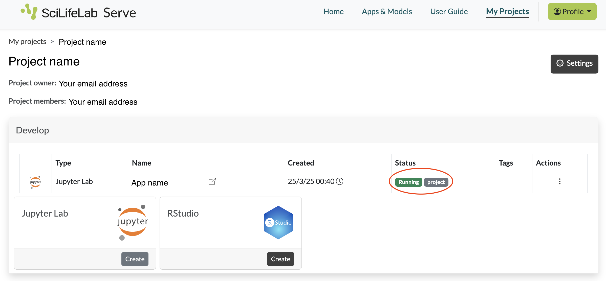

## Introduction

This course includes multiple practical exercises. During the four days we will go through practical 0 to 9 (more info in the [schedule](schedule.qmd)). Each practical has a dedicated directory in the [repository](https://github.com/elixir-europe-training/ELIXIR-SCO-spatial-omics-2026) under the practicals/ directory. Each practical directory includes:

- One or more notebooks with names starting with Practical[number] or p[number]. For example, for practical 1, we have a notebook called `Practical1_Segmentation_Cellpose.ipynb` 
- A directory (`env`) with environment files
- Any other files necessary for running the labs

## Working on the practicals

Participants of the course are recommended to use SciLifeLab Serve to run the practical exercises. If you are not a participant in the course but want to run the practicals, please see "Working locally" below.

### On SciLifeLab Serve (recommended)

:::{.callout-note}
SciLifeLab Serve is an app-hosting platform provided by SciLifeLab Sweden. All participants registered to the course will gain access to a project that has been designed for the course. In order to gain access to this project, a SciLifeLab Serve account is needed. If you do not already have an account, please follow [these instructions](https://elixir-europe-training.github.io/ELIXIR-SCO-spatial-omics-2026/serve_instructions.html).
:::

1. Log onto <https://serve.scilifelab.se>

2. When your course project has been created, you can find it under _My projects_ in the main menu. Click _Open_.



3. In the project, you can create Jupyter Lab apps and RStudio apps. Each practical requires its own app with its own environment. Jupyter Lab is used for all practicals except practical 7, which uses RStudio. To reduce memory usage, create the app only when you will start the practical, and delete the app after you have finished it. Choose the appropriate app and click _Create_.



4. You will now see a form to configure a notebook server. Under _Name_ put the name of your choice, _e.g._ the practical name. Select the Docker image for the practical you want to run. Leave the rest of the fields unchanged. Now click _Submit_.
  * Example for practical 1:



5. The notebook server will now be created for you. Wait a few minutes to see the status _Running_ in green. You can now click on its name to open it in a new tab.

:::{.callout-note}
If a password is required in Jupyter Lab or RStudio, use `spatial`.
:::




:::{.callout-note}
If the status does not turn to _Running_ within 5 minutes, click on the three dots under _Actions_ and then _Delete_. Wait a few minutes until you see the status _Deleted_. Now you can refresh the page and create a new instance starting from step 3.

:::

6. Once your app is open, download the files required for the practicals. You can download one practical at a time or all practicals at once. In a terminal window in the app, run 

```

bash download_labs.sh [practical number]
## or 
bash download_labs.sh all

```

7. Your practical should now be available under `work/practical_[number]`. Open the notebook.

:::{.callout-note}
In rare cases it may happen that your notebook server suddenly restarts. This could be due to an error that affected the notebook globally (for example, it ran out of temporary memory). You will see this on the page where you are working. A new notebook will start for you at the same URL within a few minutes.
:::


#### Storage

In the case of both JupyterLab and RStudio you have access to persistent storage. This is mounted to the folder `/home/nbis/work` (Jupyter) or `/home/rstudio/work` (RStudio). Files stored in this folder (_NB: only in this folder_) will be available even if a notebook suddenly restarts. You can also view, download these files or upload other files that will become visible in your instance through a _File Manager_ that can be launched from the bottom of the _Project_ overview page.


## Working locally

If you do not have access to  would like to work on the exercises after course, you can work locally with Docker.

The container images for each practical are in the `elixir-europe-training` namespace on dockerhub, find them [here](https://ghcr.io/elixir-europe-training/elixir-sco-spatial-omics-2026). The naming convention is `practical-[number]-[IDE]-latest`. In order to use them locally, you can use the following command (example given for practical 0):

```sh
docker run \
--rm \
--platform=linux/amd64 \
-p 8888:8888 \
-v $PWD:/home/nbis/work/ \
-e JUPYTER_ENABLE_LAB=yes \
ghcr.io/elixir-europe-training/elixir-sco-spatial-omics-2026:practical-0-jupyter-latest
```

Now, jupyter lab should be available from `localhost:8888`, use password `spatial` when prompted. 

For the rstudio image of practical 7, the equivalent would be:

```sh 
docker run \
--rm \
--platform=linux/amd64 \
-p 8787:8787 \
-v $PWD:/home/rstudio/work/ \
ghcr.io/elixir-europe-training/elixir-sco-spatial-omics-2026:practical-7-rstudio-latest
```

Now Rstudio is available from `localhost:8787`.


Once the you have accessed the app, see steps 6 and 7 above.

